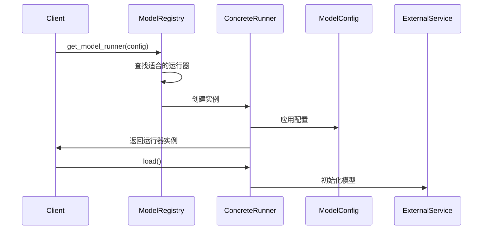
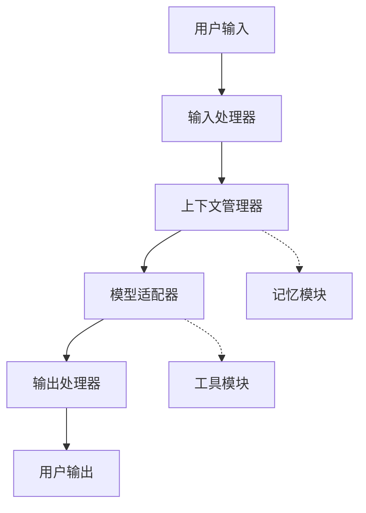
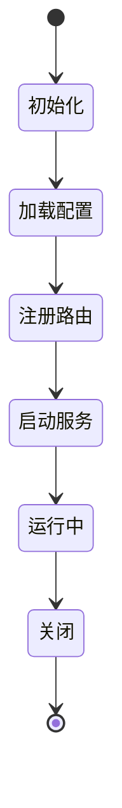
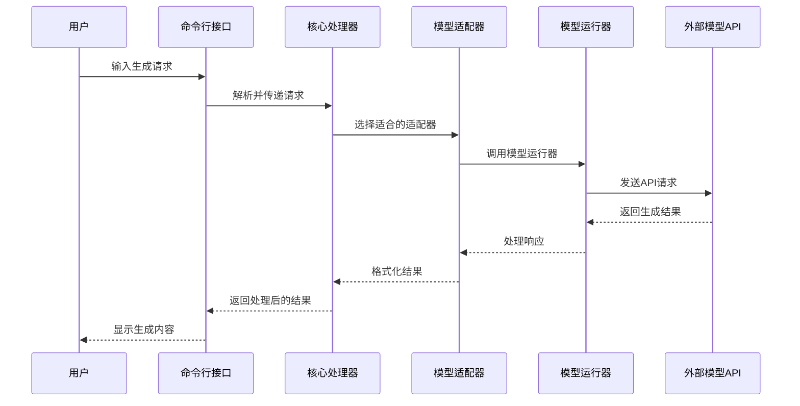

# AIgo 系统架构详解

本文档详细介绍了 AIgo 的系统架构设计、核心组件以及数据流向，帮助开发者深入理解系统内部工作机制。

## 目录

- [总体架构](#总体架构)
- [核心组件](#核心组件)
  - [模型层](#模型层)
  - [适配器层](#适配器层)
  - [模块层](#模块层)
  - [运行时层](#运行时层)
  - [接口层](#接口层)
- [数据流向](#数据流向)
- [扩展机制](#扩展机制)
- [依赖管理](#依赖管理)
- [设计模式](#设计模式)

## 总体架构

AIgo 采用分层模块化架构，每一层都有明确的职责和边界，通过定义良好的接口进行通信。这种架构设计使得系统具有高度的可扩展性、可维护性和可测试性。


整体架构分为五个主要层次：

1. **模型层**：与底层 AI 模型交互，封装不同模型提供商的API
2. **适配器层**：提供统一接口，连接外部服务和系统组件
3. **模块层**：实现核心业务逻辑和功能
4. **运行时层**：提供运行环境和服务管理
5. **接口层**：向外部提供命令行和 API 等交互接口

## 核心组件

### 模型层

模型层是 AIgo 的基础，负责与实际的 AI 模型进行交互。

#### 关键组件

1. **ModelConfig**：模型配置类，定义了模型的参数和设置
   - 路径：`aigo/models/base.py`
   - 职责：封装模型配置信息，如模型名称、提供商、参数等

2. **BaseModelRunner**：模型运行器抽象基类
   - 路径：`aigo/models/base.py`
   - 职责：定义模型运行器的通用接口，如加载、生成文本、嵌入等

3. **具体模型运行器**：特定提供商的模型运行器实现
   - 路径：`aigo/models/providers/`
   - 典型实现：
     - `OllamaRunner`：与 Ollama 服务交互
     - `OpenAIRunner`：与 OpenAI API 交互

4. **ModelRegistry**：模型注册表
   - 路径：`aigo/models/__init__.py`
   - 职责：管理模型运行器的注册和查找

#### 模型加载流程



### 适配器层

适配器层在模型层之上提供更高级的功能，同时处理与外部系统的通信。

#### 关键组件

1. **ModelAdapter**：模型适配器基类
   - 路径：`aigo/models/adapters.py`
   - 职责：为特定任务提供高级API，如聊天、文本生成等

2. **存储适配器**：
   - 路径：`aigo/adapters/storage/`
   - 职责：提供统一的存储访问接口，支持文件系统、数据库等

3. **向量数据库适配器**：
   - 路径：`aigo/adapters/vector/`
   - 职责：封装向量数据库操作，支持语义搜索和相似度查询

4. **Web服务适配器**：
   - 路径：`aigo/adapters/web/`
   - 职责：封装HTTP请求和响应处理

#### 适配器类型

| 适配器类型 | 描述 | 关键接口 |
|----------|------|---------|
| ChatAdapter | 处理多轮对话 | `process(messages)` |
| TextGenerationAdapter | 处理文本生成 | `generate(prompt)` |
| EmbeddingAdapter | 处理文本嵌入 | `embed(text)` |
| StorageAdapter | 数据持久化 | `read(key)`, `write(key, value)` |
| VectorAdapter | 向量操作和搜索 | `store(id, vector)`, `search(query, k)` |

### 模块层

模块层包含实现核心业务逻辑的功能模块。

#### 关键组件

1. **记忆模块**：
   - 路径：`aigo/modules/memory/`
   - 职责：管理对话历史和上下文窗口

2. **处理器模块**：
   - 路径：`aigo/modules/processor/`
   - 职责：处理输入和输出，如模板渲染、格式转换等

3. **工具模块**：
   - 路径：`aigo/modules/tools/`
   - 职责：提供各种辅助功能，如网络搜索、计算器等

#### 模块交互示例



### 运行时层

运行时层管理服务的生命周期和运行环境。

#### 关键组件

1. **APIServer**：
   - 路径：`aigo/runtime/api_server.py`
   - 职责：提供REST API服务

2. **任务调度器**：
   - 路径：`aigo/runtime/scheduler.py`
   - 职责：管理异步任务和定时任务

3. **会话管理器**：
   - 路径：`aigo/runtime/session.py`
   - 职责：管理用户会话和状态

#### 服务生命周期



### 接口层

接口层提供与外部系统或用户的交互方式。

#### 关键组件

1. **命令行接口**：
   - 路径：`aigo/cli/`
   - 职责：处理命令行参数和提供CLI功能

2. **REST API**：
   - 路径：`aigo/runtime/api_server.py`
   - 职责：提供HTTP API端点

3. **WebUI**：
   - 路径：`aigo/webui/`
   - 职责：提供Web界面（如果有）

## 数据流向

AIgo中的数据流向可以通过以下典型场景来描述：

### 文本生成流程

1. 用户通过CLI或API提交生成请求
2. 接口层接收请求并解析参数
3. 运行时层创建处理上下文
4. 模块层进行预处理（如模板渲染）
5. 适配器层选择合适的模型适配器
6. 模型层调用底层模型API获取结果
7. 结果通过各层处理后返回给用户



## 扩展机制

AIgo 设计了灵活的扩展机制，使开发者可以轻松添加新功能。

### 添加新模型

添加新的模型提供商只需以下步骤：

1. 在 `aigo/models/providers/` 下创建新的运行器类
2. 实现 `BaseModelRunner` 接口
3. 使用 `@register_model` 装饰器注册模型运行器

```python
# aigo/models/providers/my_provider.py
from aigo.models.base import BaseModelRunner, ModelConfig, register_model

@register_model("my-provider")
class MyProviderRunner(BaseModelRunner):
    name = "my-provider"
    
    @classmethod
    def supports(cls, config: ModelConfig) -> bool:
        return config.provider.lower() == "my-provider"
        
    def load(self):
        # 实现加载逻辑
        pass
        
    def generate(self, prompt: str, **kwargs) -> str:
        # 实现生成逻辑
        pass
```

### 添加新适配器

添加新的适配器类型：

1. 在相应的适配器目录下创建新类
2. 实现适当的基类接口
3. 在适配器工厂中注册新类型

```python
# aigo/adapters/storage/redis_adapter.py
from aigo.adapters.storage.base import StorageAdapter

class RedisStorageAdapter(StorageAdapter):
    def __init__(self, config):
        super().__init__(config)
        # 初始化Redis连接
        
    def read(self, key):
        # 从Redis读取数据
        pass
        
    def write(self, key, value):
        # 写入数据到Redis
        pass
```

### 添加新CLI命令

扩展命令行功能：

1. 在 `aigo/cli/commands/` 下创建新的命令模块
2. 实现命令处理函数
3. 在 `aigo/cli/__main__.py` 中注册新命令

```python
# aigo/cli/commands/analyze.py
def add_analyze_parser(subparsers):
    parser = subparsers.add_parser("analyze", help="分析文本数据")
    parser.add_argument("--file", help="要分析的文件路径")
    parser.set_defaults(func=handle_analyze)

def handle_analyze(args):
    # 实现分析逻辑
    print(f"分析文件: {args.file}")
```

## 依赖管理

AIgo 采用依赖注入和工厂模式来管理组件间的依赖关系。

### 关键依赖机制

1. **服务定位器**：
   - 路径：`aigo/utils/service_locator.py`
   - 职责：提供全局依赖查找和注册

2. **工厂函数**：
   - 各组件中使用工厂函数创建实例
   - 例如：`get_model_runner()`, `create_adapter()`

3. **配置依赖**：
   - 配置层级决定了组件初始化方式
   - 默认配置 < 环境变量 < 命令行参数

```python
# 依赖注入示例
def get_embedding_service(config=None):
    """获取嵌入服务的工厂函数"""
    if config is None:
        config = load_default_config()
    
    model_config = ModelConfig(
        provider=config.get("models.embedding.provider"),
        model_name=config.get("models.embedding.name")
    )
    
    runner = get_model_runner(model_config)
    adapter = EmbeddingAdapter(runner)
    return adapter
```

## 设计模式

AIgo 采用了多种设计模式来解决不同的架构挑战：

### 适配器模式

用于将不同的模型API统一到通用接口：

```python
# 示例：适配器模式
class OpenAIAdapter(ChatAdapter):
    def process(self, messages):
        # 将通用消息格式转换为OpenAI格式
        openai_messages = self._convert_messages(messages)
        # 调用OpenAI API
        response = self.client.chat.completions.create(
            model=self.model_name,
            messages=openai_messages
        )
        # 将OpenAI响应转换为通用格式
        return self._convert_response(response)
```

### 工厂模式

用于创建复杂对象：

```python
# 示例：工厂模式
def create_adapter(adapter_type, config):
    """适配器工厂函数"""
    if adapter_type == "chat":
        return ChatAdapter(config)
    elif adapter_type == "embedding":
        return EmbeddingAdapter(config)
    elif adapter_type == "completion":
        return TextGenerationAdapter(config)
    else:
        raise ValueError(f"未知适配器类型: {adapter_type}")
```

### 观察者模式

用于事件通知和处理：

```python
# 示例：观察者模式
class EventBus:
    def __init__(self):
        self.subscribers = defaultdict(list)
    
    def subscribe(self, event_type, callback):
        self.subscribers[event_type].append(callback)
    
    def publish(self, event_type, data=None):
        for callback in self.subscribers[event_type]:
            callback(data)

# 使用示例
event_bus = EventBus()
event_bus.subscribe("model_loaded", lambda model: logger.info(f"模型已加载: {model}"))
event_bus.publish("model_loaded", "deepseek-r1:8b")
```

### 策略模式

用于运行时切换算法：

```python
# 示例：策略模式
class TokenizerStrategy(ABC):
    @abstractmethod
    def tokenize(self, text: str) -> List[str]:
        pass

class SimpleTokenizer(TokenizerStrategy):
    def tokenize(self, text: str) -> List[str]:
        return text.split()

class SentencePieceTokenizer(TokenizerStrategy):
    def __init__(self, model_path):
        import sentencepiece as spm
        self.sp = spm.SentencePieceProcessor()
        self.sp.Load(model_path)
    
    def tokenize(self, text: str) -> List[str]:
        return self.sp.EncodeAsPieces(text)
```

通过这些设计模式的应用，AIgo 实现了高内聚低耦合的模块化架构，使系统更加灵活、可扩展和易于维护。 